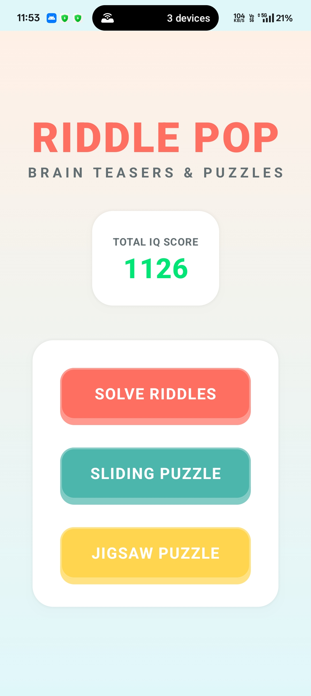
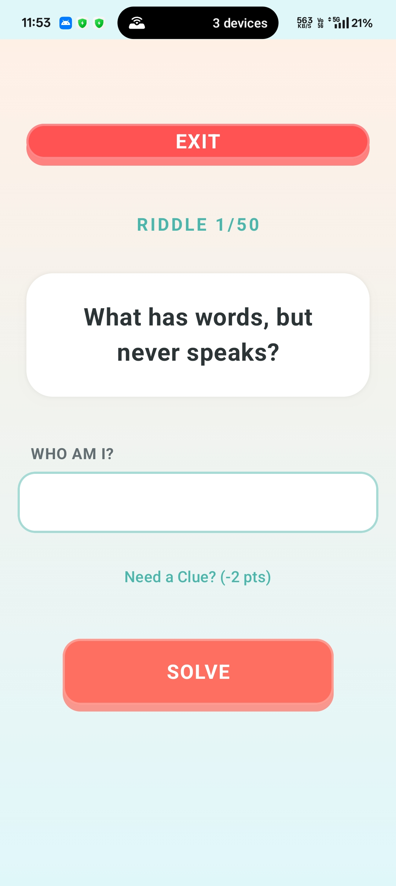
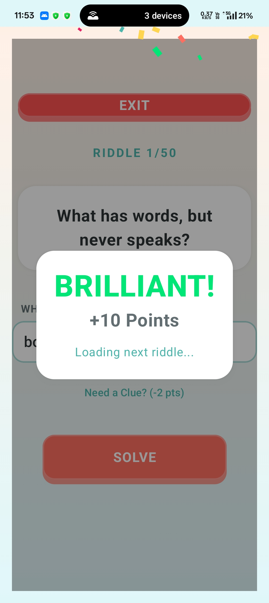
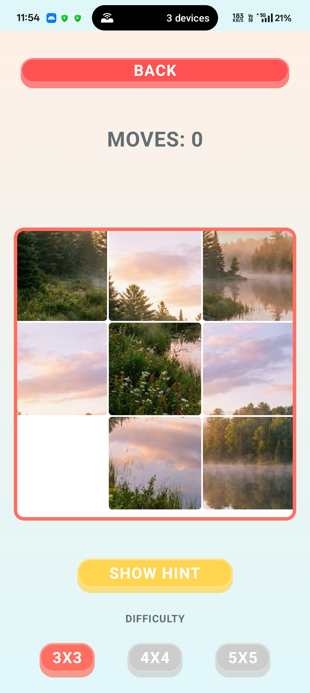
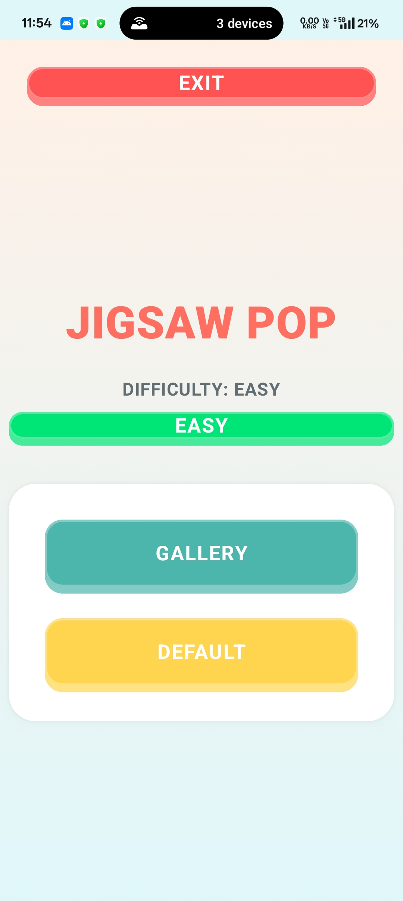

# 🌞 Riddle Pop: The Sunny Brain Teaser Collection


**Riddle Pop** is a vibrant, "Dopamine Design" puzzle game built entirely with **Jetpack Compose**. It moves away from dark, arcade aesthetics to a "Sunny Pop" theme—featuring soft gradients, 3D gummy buttons, and physics-based interactions.

The app features three distinct game modes powered by a reactive **MVVM architecture** and local persistence via **Room Database**.

---

## 🚀 Installation

1.  Clone the repository.
2.  Open in **Android Studio**.
3.  Sync Gradle.
4.  Run on Emulator or Device.

```bash
git clone https://github.com/pranav-wakode/riddle-pop.git
cd riddle-pop
./gradlew assembleDebug
```
---

## 🎨 visual Showcase

### 🏠 The Hub & Aesthetic
The main entry point features a warm, engaging UI with a reactive total score display that updates via **Kotlin Flows** the moment a game is finished.

<div align="center">
  
</div>

---

### 🧠 Logic & Riddles
A collection of 50+ clever riddles with a risk-reward scoring system.
* **Correct Answer:** +10 Points.
* **Hint Used:** Dynamic deduction (Score reduced to +8).
* **Features:** Immediate feedback, shake animations on error, and "Mega Confetti" celebration.

| The Challenge | The Victory |
|:---:|:---:|
|  |  |
| *Clean input fields & hint system* | *Particle system celebration* |

---

### 🧩 Puzzle Engines
Two distinct puzzle engines built from scratch using Canvas and Bitmaps.

| Sliding Puzzle | Jigsaw Construction |
|:---:|:---:|
|  |  |
| **Logic:** N-Puzzle Algorithm<br>**Features:** 3x3/4x4/5x5 Difficulty, Ghost Overlay Hint, Move Counter. | **Logic:** Free-form Drag & Drop<br>**Features:** Tray system, Z-Index lifting, Snap-to-grid mechanics. |

---

## 🛠️ Technical Highlights

This project demonstrates advanced Android development concepts:

* **Jetpack Compose UI:** 100% declarative UI. No XML layouts.
* **Custom Graphics:**
    * **Confetti System:** A custom, lag-free particle system using `Canvas` and `withFrameNanos` for 60fps rendering.
    * **Bitmap Manipulation:** Programmatic cropping and scaling for splitting images into puzzle chunks.
* **Architecture (MVVM):**
    * **ViewModels:** Manage game state (timer, score, piece positions) surviving configuration changes.
    * **StateFlow/Flow:** Reactive data streams for real-time UI updates.
* **Data Persistence:**
    * **Room Database:** Stores user scores with LiveData/Flow integration to update the Home Screen instantly.
* **UX Micro-interactions:**
    * Buttons "squish" when pressed (AnimationSpec).
    * Puzzle pieces float (Shadow/Z-Index) when dragged.
    * Error states trigger haptic/visual shake feedback.